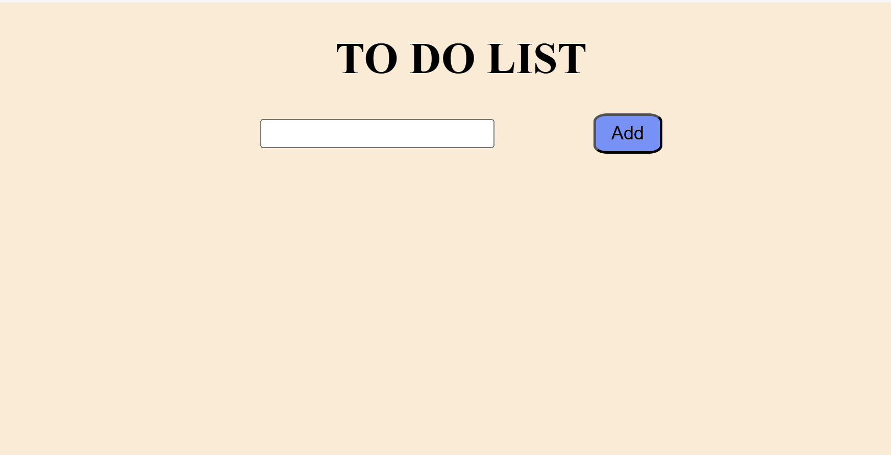
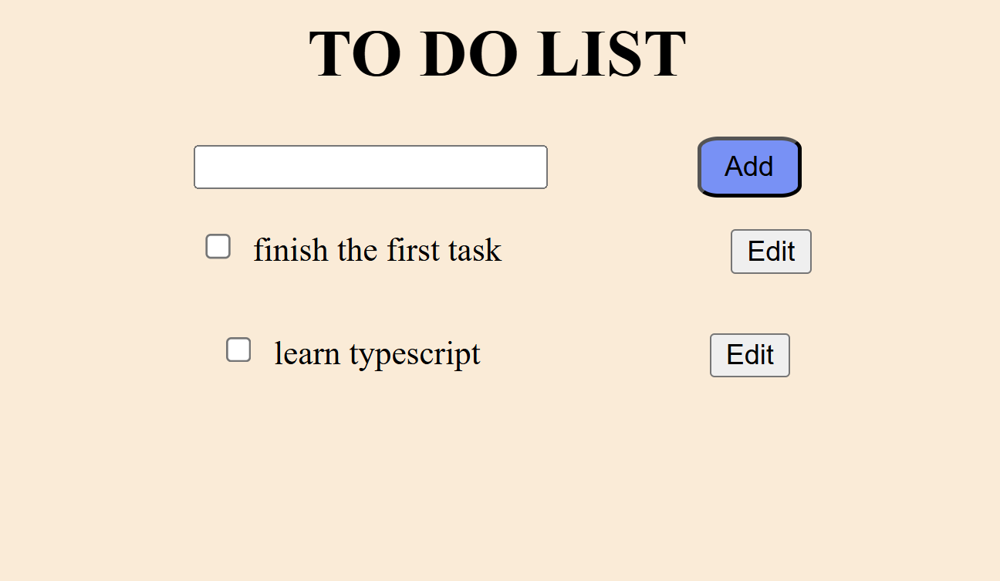

# TO-DO-LIST-APP-with-javascript

This is a simple To-Do List application built using HTML, CSS, and JavaScript. 

## Features

- **Add Tasks**: Users can input tasks and add them to the list.
- **Edit Tasks**: Users can edit the content of existing tasks.
- **Delete Tasks**: Users can remove tasks from the list by checking a checkbox.

## Getting Started

To run the application locally, follow these steps:

1. **clone the repository**
```bash 
git clone https://github.com/Rediet-W/TO-DO-LIST-APP-with-javascript.git  

cd TO-DO-LIST-APP-with-javascript 

open index.html```



initial page with no task added

tasks added and with edit buttons and checkbox to mark/delete a task